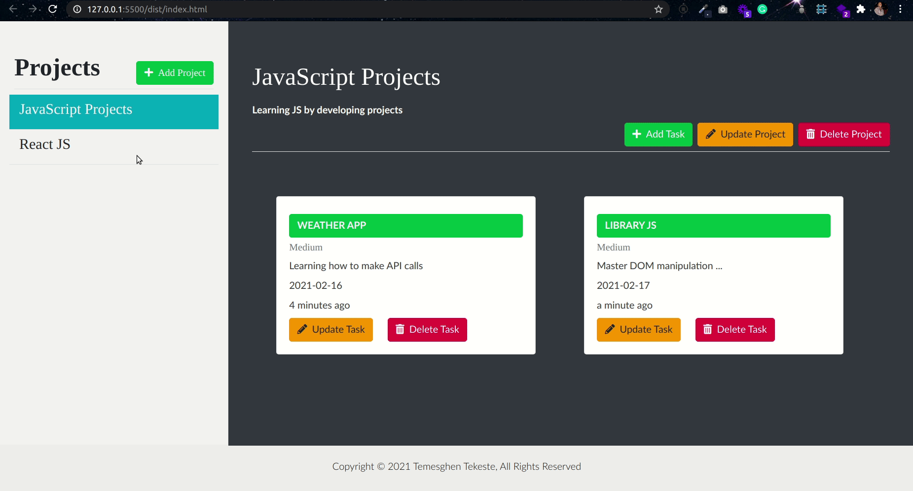

# Todo JS

## Content

<a text-align="center" href="#about">About</a>&nbsp;&nbsp;&nbsp;|&nbsp;&nbsp;&nbsp;
<a href="#description">Description</a>&nbsp;&nbsp;&nbsp;|&nbsp;&nbsp;&nbsp;
<a href="#live">Live Demo</a>&nbsp;&nbsp;&nbsp;|&nbsp;&nbsp;&nbsp;
<a href="#screenshots">Screenshots</a>&nbsp;&nbsp;&nbsp;|&nbsp;&nbsp;&nbsp;
<a href="#with">Built with</a>&nbsp;&nbsp;&nbsp;|&nbsp;&nbsp;&nbsp;
<a href="#setup">Setup</a>&nbsp;&nbsp;&nbsp;|&nbsp;&nbsp;&nbsp;
<a href="#prerequisites">Prerequisites</a>&nbsp;&nbsp;&nbsp;|&nbsp;&nbsp;&nbsp;
<a href="#author">Author</a>

## About 

Todo JS is a JavaScript project that is intended to showcase an understanding of such JavaScript concepts as Objects, Factory Functions, The Module Pattern, and OOP. The project also illustrates the concepts of Single Responsibility and Tightly Coupled Objects. The codebase is well structured into different modules using Webpack. To persist the data localStorage is implemented.

<h3>Description </h3>
<h4>This project allows a user to:</h4>
<li>Create a project</li>
<li>Update a project</li>
<li>Delete a project</li>
<li>Add tasks to a project</li>
<li>Update a particular task</li>
<li>Delete task from a project</li>
<li>Persist projects using browser's localStorage</li>

## 🔴 Live Demo 

**Click [here](https://todo-js-temesghen.netlify.app/) in order to see a Live Demo of this project.**

## Screenshots 

 

## 🔧 Built with

- Vanilla JavaScript
- ES6
- HTML
- SCSS
- Webpack
- ESLint
- StyleLint

## 🔨 Setup
### Run a Local Copy
- Download the repository to a local directory on your computer.
- Or run the following commands on the terminal
  $ git clone https://github.com/temesghentekeste/todo-js.git
  $ cd todo-js
  $ npm install
  $ npm install --only=dev
  $ npm start (This is the development mode)
  $ npm run build (This is the production mode)

### Run a Test
  $ npm test (or) npm run watch

## Prerequisites
- npm
- A modern up-to-date browser
- Text Editor

## ✒️  Author 

👤 **Temesghen Tekeste**

- Github: [@temesghentekeste](https://github.com/temesghentekeste)
- Twitter: [@temesghentekes1](https://twitter.com/temesghentekes1)
- Linkedin: [temsghen tekeste](https://www.linkedin.com/in/temesghentekeste/)

## 🤝 Contributing

Contributions, issues and feature requests are welcome!

Feel free to check the [issues page](https://github.com/temesghentekeste/todo-js/issues).

## 👍 Show your support

Give a ⭐️ if you like this project!

## :clap: Acknowledgements
- <a href="https://www.microverse.org/" target="_blank">microverse.org</a>
- <a href="https://www.theodinproject.com/" target="_blank">The Odin Project</a>
- <a href="https://netlify.com/" target="_blank">netlify</a>
</a>

